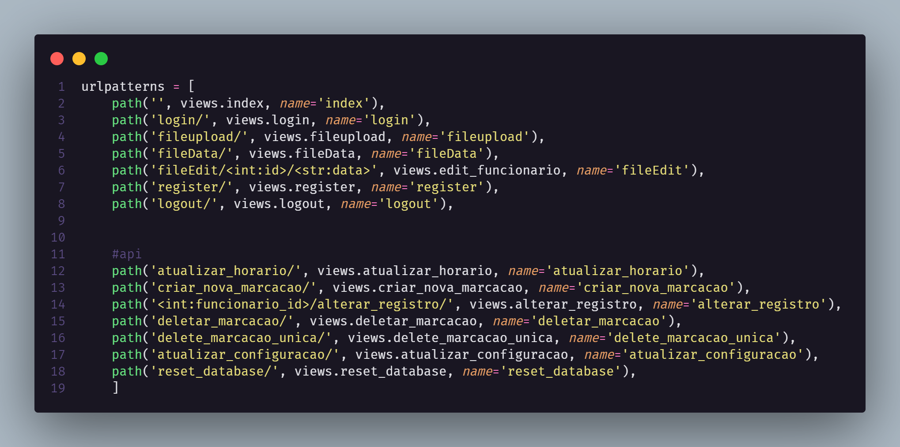

# 

O projeto consiste na criação de um sistema eficiente de leitura e processamento de arquivos AFD de cartões de ponto REP. Essa solução automatiza o controle de presença e horas trabalhadas dos funcionários, garantindo a conformidade com as regulamentações trabalhistas. A aplicação importa os arquivos AFD, interpreta os registros de ponto, calcula as horas trabalhadas e fornece relatórios detalhados, simplificando a gestão do tempo dos colaboradores e otimizando o cumprimento das obrigações legais.


## 🌟 Funcionalidades Principais

- 📂 Leitura e inserção de dados de arquivos AFD no banco de dados.
- 👤 Criação e gestão de contas para administradores de empresa.
- 🏢 Cadastro de empresas, funcionários e registros de entrada e saída.
- 📋 Anexo de faltas, justificativas e atestados médicos.

## 🌐 URLs e Views




## 🛠️ Tecnologias Utilizadas

| Área | Tecnologia | Descrição | Badge |
| --- | --- | --- | --- |
| Backend | Django | Um framework web Python de alto nível que incentiva o desenvolvimento rápido e design limpo. |  |
| Frontend | JavaScript | Uma linguagem de programação que é usada principalmente para criar interatividade em sites. |  |
| Frontend | TailwindCSS | Um framework CSS de utilidade para construção rápida de interfaces de usuário. |  |
| Banco de Dados | SQLite | Uma biblioteca em linguagem C que implementa um banco de dados SQL embutido. |  |


## 📝 Instalação

Siga os passos abaixo para configurar o projeto:

1. 🚀 Clone o repositório:
    ```sh
    git clone link_repositorio
    ```

2. 🐍 Crie um ambiente virtual Python:
    ```sh
    python -m venv nome_venv
    ```

3. 🔁 Ative o ambiente virtual:
    - Windows:
        ```sh
        nome_venv\scripts\activate
        ```
    - Linux/MacOs:
        ```sh
        source nome_venv/bin/activate
        ```

4. 📦 Instale as dependências:
    ```sh
    pip install -r requirements.txt
    ```

5. 🗃️ Execute as migrações do banco de dados:
    ```sh
    python manage.py migrate
    ```

6. 🚀 Inicie o servidor Django:
    ```sh
    python manage.py runserver
    ```

# Apresentação 🎥

- Confira uma apresentação do Trinity no YouTube:

- 


# Licença 📜

This project is licensed under the MIT License. See the LICENSE file for more information.

Copyright 2024 Iuri de Lima Ferreira

Permission is hereby granted, free of charge, to any person obtaining a copy of this software and associated documentation files (the “Software”), to deal in the Software without restriction, including without limitation the rights to use, copy, modify, merge, publish, distribute, sublicense, and/or sell copies of the Software, and to permit persons to whom the Software is furnished to do so, subject to the following conditions:

The above copyright notice and this permission notice shall be included in all copies or substantial portions of the Software.

THE SOFTWARE IS PROVIDED “AS IS”, WITHOUT WARRANTY OF ANY KIND, EXPRESS OR IMPLIED, INCLUDING BUT NOT LIMITED TO THE WARRANTIES OF MERCHANTABILITY, FITNESS FOR A PARTICULAR PURPOSE AND NONINFRINGEMENT. IN NO EVENT SHALL THE AUTHORS OR COPYRIGHT HOLDERS BE LIABLE FOR ANY CLAIM, DAMAGES OR OTHER LIABILITY, WHETHER IN AN ACTION OF CONTRACT, TORT OR OTHERWISE, ARISING FROM, OUT OF OR IN CONNECTION WITH THE SOFTWARE OR THE USE OR OTHER DEALINGS IN THE SOFTWARE.


